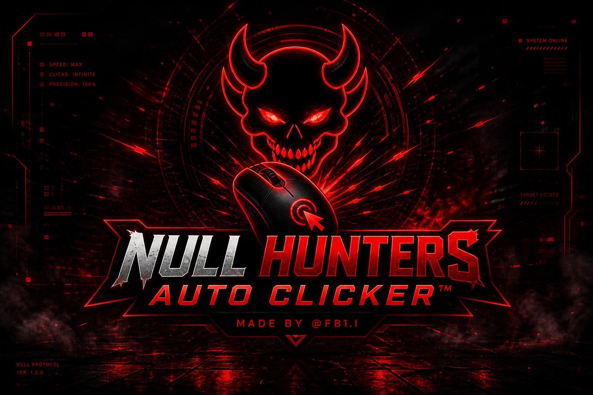
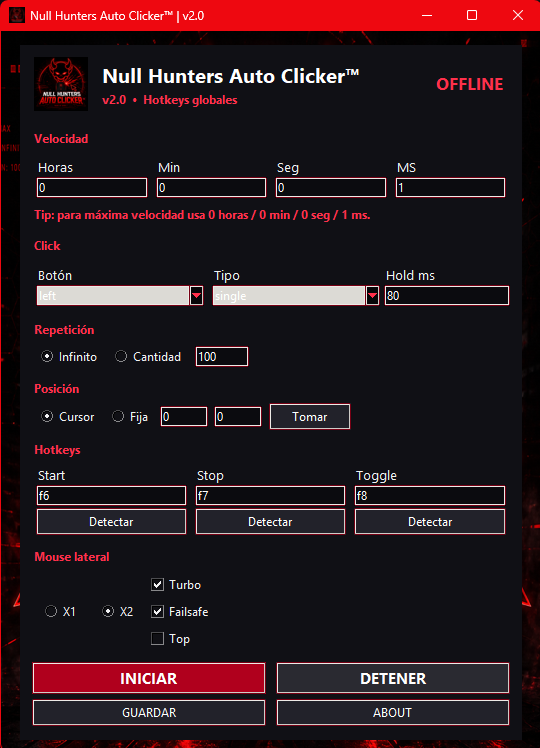
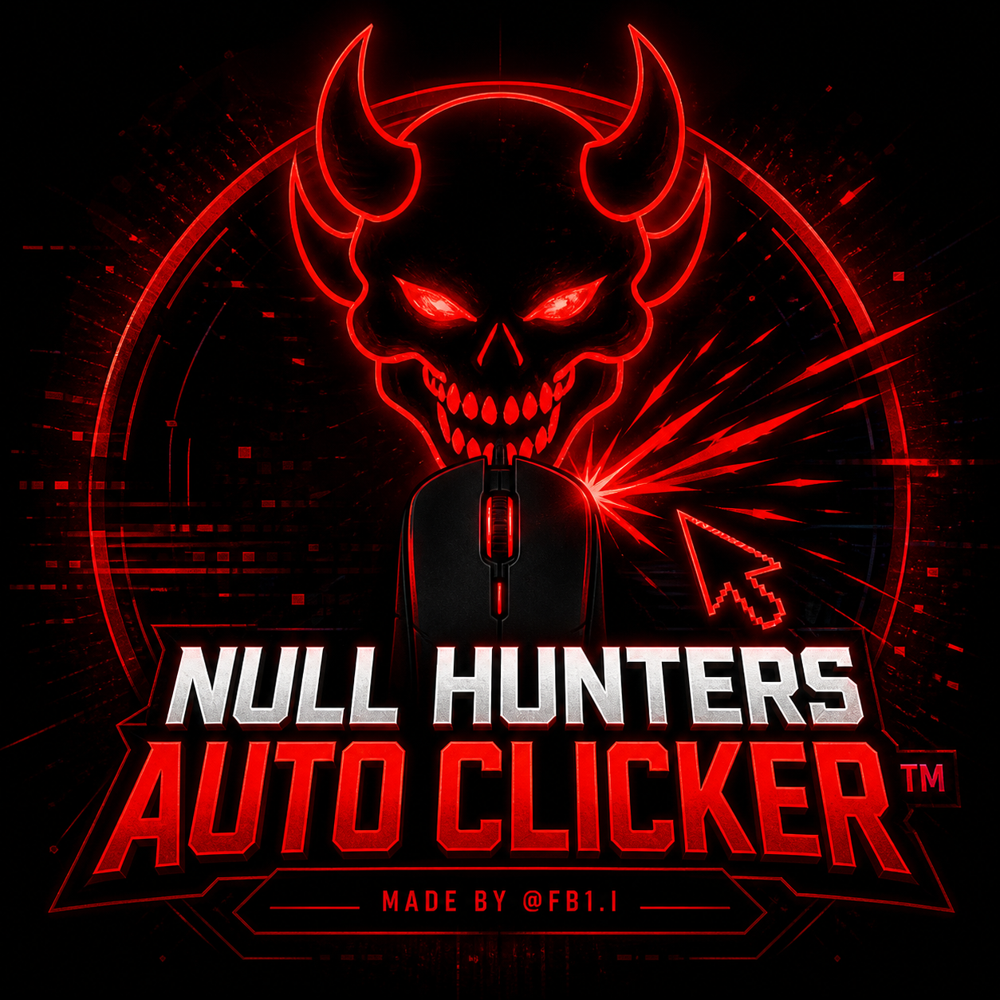

# 🩸 Null Hunters Auto Clicker™

High Performance Auto Click Engine
Built for speed, precision and total control.

---

  

<h1 align="center">NULL HUNTERS AUTO CLICKER™</h1>

  <b>Click • Control • Dominate</b>

---

  
  
  
  
  
  

---

## 🧠 Descripción

**Null Hunters Auto Clicker™** es una herramienta avanzada de automatización diseñada para generar clicks de alta velocidad con precisión total.

Optimizada para rendimiento extremo, permite controlar cada parámetro del click, incluyendo velocidad, repetición, posición y hotkeys globales, todo dentro de una interfaz profesional con identidad Null Hunters.

---

## ⚡ Características

* ⚡ Clicks en tiempo real ultra rápidos
* 🎯 Control de velocidad (horas, minutos, segundos, ms)
* 🔁 Repetición infinita o por cantidad
* 🖱️ Selección de botón (left, right, double)
* 📍 Modo cursor o posición fija
* ⌨️ Hotkeys globales (Start / Stop / Toggle)
* 🚀 Modo Turbo integrado
* 🧠 Sistema optimizado sin lag
* 🔥 Interfaz estilo Null Hunters

---

## 🖥️ Vista del Sistema

  

---

## 📦 Descarga

Disponible en la sección **Releases**

**Archivo principal:**

`Null Hunters Auto Clicker.exe`

---

## ⚙️ Uso

1. Ejecuta el archivo `.exe`
2. Configura la velocidad de clicks
3. Selecciona tipo de click
4. Ajusta repetición o posición
5. Define hotkeys
6. Presiona `INICIAR`

---

## 🧠 Estado del Sistema

| Módulo       | Estado    |
| ------------ | --------- |
| Engine       | ACTIVE    |
| Click System | REAL-TIME |
| Hotkeys      | ENABLED   |
| Turbo Mode   | ACTIVE    |
| Performance  | OPTIMAL   |

---

## 🌐 Comunidad

* 👑 Owner: `@FB1.I`
* 🩸 Brand: **Null Hunters**
* 💬 Discord: https://discord.gg/Rfs9N3fya4
* 🌐 Web: https://guns.lol/nullhunters

---

## 👿 Branding

  

  <b>NULL HUNTERS</b> 
  Automation • Precision • Performance Tools

---

## ⚠️ Aviso

Este software está destinado a automatización básica, pruebas y uso personal.

El uso en plataformas, juegos o servicios donde esté prohibido el auto click puede resultar en sanciones. El usuario es responsable de su uso.

---

## 📜 Licencia

MIT License

---

## 🧬 Identidad

**Null Hunters © 2026**
**We don’t click. We dominate.**
